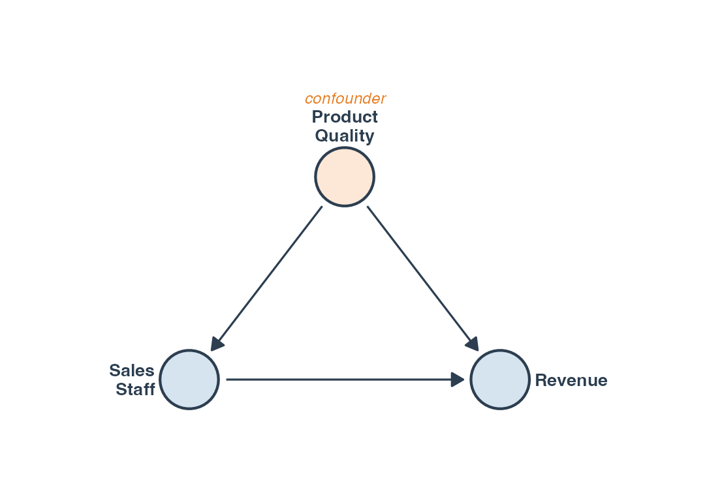
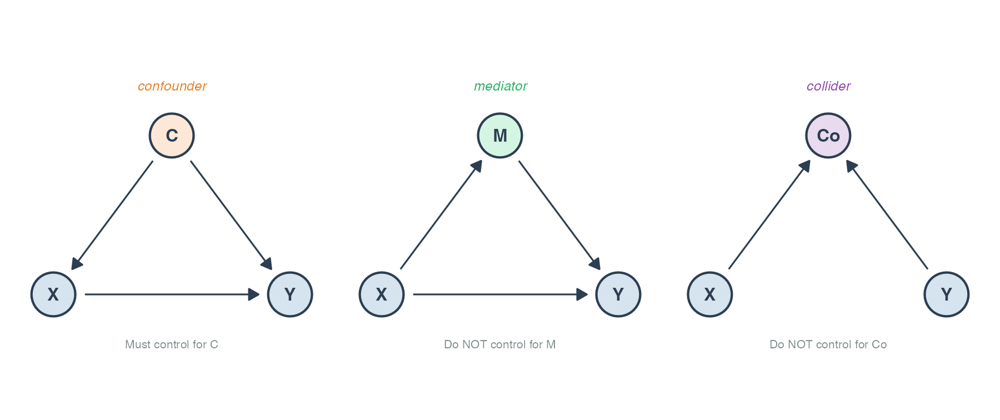
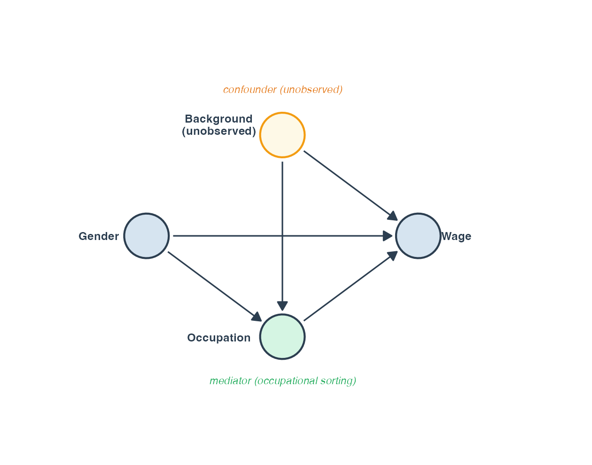
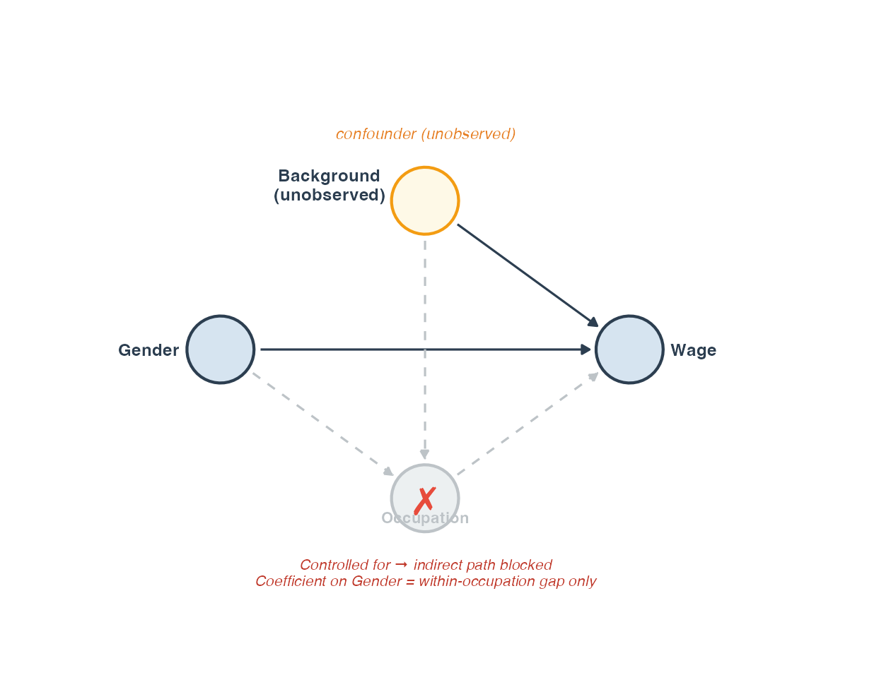

## Today's session

- **Where we are:** You can specify, estimate, and diagnose regression models
- **Today's question:** What do those coefficients actually *claim*?
- **The shift:** From estimation to interpretation — from *how* to *what it means*

. . .

::: {.callout-note}
No new estimator today. The methodological move is entirely in interpretation.
:::

---

## A puzzle from hiring data

A consultancy analyses firm-level data and finds:

> *"Firms that hired more sales staff last year had **lower revenue** this year."*

**Conclusion:** Hiring sales staff reduces revenue. Cut the sales team.

. . .

**Wait.** What else might explain this pattern?

---

## The confounder hiding in plain sight

{fig-align="center" width="70%"}

**Product quality** drives both hiring decisions *and* revenue.

- Firms with poor products hire more staff to compensate
- Poor products also depress revenue

The correlation between hiring and revenue is **real** — but the causal story is backwards.

---

## The identification question

Regression answers:

> *"How does Y vary with X, holding controls constant?"*

That is **not** the same as:

> *"What is the effect of X on Y?"*

. . .

The gap between the two is closed — or not — by an **identification argument**.

::: {.callout-important}
**Association vs. causation:** A regression coefficient is associational by default. Causal interpretation requires an identification argument that lives *outside* the regression output.
:::

---

## DAGs: a language for causal structure

**DAG (Directed Acyclic Graph):** A diagram where nodes are variables and arrows represent direct causal effects. *Acyclic* means no variable causes itself.

. . . 

We use DAGs to make our causal assumptions **explicit and testable**.

. . . 

Three structural roles a variable can play:

1. **Confounder**
2. **Mediator**
3. **Collider**

---

## Three structural roles

{fig-align="center" width="90%"}

::: {.incremental}
- **Confounder:** Common cause of X and Y → *must* control
- **Mediator:** On the causal path from X to Y → *must not* control (if you want the total effect)
- **Collider:** Caused by both X and Y → *must not* control (conditioning opens a spurious path)
:::

---

## Application: the gender wage gap

We want to know: **does gender affect wages?**

Let's draw the causal structure before running a single regression.

. . .

What factors are in play?

::: {.incremental}
- **Direct effect:** gender → wage (e.g. discrimination in pay setting)
- **Occupational sorting:** gender → occupation → wage
- **Unobserved background:** family background, networks → both occupation and wage
:::
---

## The gender wage gap DAG

{fig-align="center" width="80%"}

**Key question:** What happens when we add occupation as a control variable?

---

## The bad control

{fig-align="center" width="80%"}

Controlling for occupation **blocks** the path: gender → occupation → wage

. . .

::: {.incremental}
- The coefficient on gender *shrinks* — but not because we found a better estimate
- We are now estimating a **different, narrower question**: the direct pay gap *within* occupations
- Whether that is interesting depends on the research question
:::

. . . 

::: {.callout-important}
**Bad control:** A mediator or collider incorrectly added as a control variable. The result is not more precise — it answers a different question.
:::

---

## Live demo: three models, three questions

Using CPS earnings data (149,316 US workers, 2014):

| Model | Specification | Question answered |
|-------|--------------|-------------------|
| 1 | `wage ~ gender` | Raw gap |
| 2 | `wage ~ gender + age + education` | Gap controlling for demographics |
| 3 | `wage ~ gender + age + education + occupation` | Gap *within* occupations |

. . .

The coefficient on gender shrinks from Model 1 → 3.

**This does not mean Model 3 is more correct.** It means each model answers a different question.

---

## What makes a coefficient causal?

Not the regression itself — the **identification argument**.

An identification argument claims: *"The variation in X I am exploiting is as good as random with respect to Y."*

. . .

Two strategies you will learn:

- **Session 6 — Panel fixed effects:** Control for all stable unobserved differences across units
- **Session 7 — Randomised experiments:** Randomisation makes treatment assignment independent of everything else

::: {.callout-note}
These strategies are not more credible because the math is different. They are more credible because they provide an identification argument.
:::

---

## In-class exercise

**Task 1 — Reproduce and interpret:**
Run the three-model progression on `cps-earnings`. For each model, write 3–5 sentences: *"What causal claim, if any, can this model support — and why?"*

. . . 

**Task 2 — Draw the DAG:**
A firm wants to know whether advertising causes sales. Both are also driven by product quality, and advertising success may itself affect product investment.

- Draw the DAG
- Identify any confounders, mediators, or colliders
- What would you need to control for — and what should you avoid controlling for?

---

## Where we go next

**Today:** You know what an identification argument is, and why regression alone cannot provide one.

**Session 6:** Panel fixed effects — exploiting within-unit variation over time to control for all stable unobserved differences.

**Session 7:** A randomised experiment — where randomisation itself is the identification argument.

. . .

> *Now you know why those sessions matter.*
