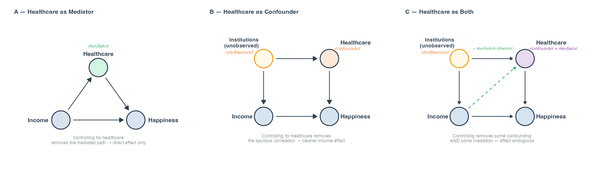

```{r}
#| label: setup
#| include: false
#| eval: true
library(tidyverse)
library(fixest)
library(modelsummary)
library(patchwork)
```

```{r}
#| label: load-data
#| include: false
#| eval: true
dat <- read_csv(
  here::here("sessions/session_06/data/happiness_income.csv"),
  show_col_types = FALSE
) |> 
  filter(!is.na(happiness), !is.na(GDP_pc))
```


# Motivation

## Does money buy happiness?

**Cross-sectional evidence:** yes, clearly.

```{r}
#| label: fig-cross-section
#| echo: false
#| eval: true
#| fig-height: 4.5
year_use <- max(dat$year, na.rm = TRUE)

dat |>
  filter(year == year_use) |>
  ggplot(aes(log(GDP_pc), happiness)) +
  geom_point(aes(size = sqrt(population)), colour = "#2C5F8A", alpha = 0.6) +
  geom_smooth(method = "lm", colour = "#D04A2F", se = TRUE,
              fill = "#D04A2F", alpha = 0.12, linewidth = 1) +
  scale_size_continuous(range = c(1, 8), guide = "none") +
  labs(
    x       = "Log GDP per capita (PPP)",
    y       = "Life satisfaction (0–10)",
    caption = paste0("Source: WHR ", year_use, " & World Bank WDI · Point size = population")
  ) +
  theme_minimal(base_size = 13) +
  theme(plot.background = element_rect(fill = "white", colour = NA))
```

::: {.notes}
Open with this chart — let students react. The positive correlation
is clean and robust. Ask: "So richer countries are happier. Does that
mean getting richer makes a country happier?" Then introduce the paradox.
:::

## The Easterlin Paradox

**Richard Easterlin (1974):** richer countries are happier, yet rising
incomes within countries don't always produce rising happiness.

. . .

```{r}
#| label: fig-easterlin
#| echo: false
#| eval: true
#| fig-height: 3.6
easterlin_countries <- c("United States", "Japan", "South Korea",
                          "China", "Germany")

col_easterlin <- c(
  "United States" = "#D04A2F",
  "Japan"         = "#e67e22",
  "South Korea"   = "#8e44ad",
  "China"         = "#2C5F8A",
  "Germany"       = "#4A9B6F"
)

dat |>
  filter(country %in% easterlin_countries, !is.na(happiness)) |>
  ggplot(aes(year, happiness, colour = country)) +
  geom_line(linewidth = 1.1) +
  geom_point(size = 1.8) +
  scale_colour_manual(values = col_easterlin, name = NULL) +
  scale_x_continuous(breaks = seq(2006, 2024, by = 4)) +
  labs(
    x       = NULL,
    y       = "Life satisfaction (0–10)",
    caption = "Source: World Happiness Report (3-year averages)"
  ) +
  theme_minimal(base_size = 13) +
  theme(
    legend.position    = "right",
    plot.background    = element_rect(fill = "white", colour = NA)
  )
```

. . .

*How can both patterns be true at the same time?*

::: {.callout-note}
## This is not just a happiness puzzle
It is a fundamental question about what kind of comparison we are making
— and it shows the value added of panel data.
:::

## Two different comparisons

```{=html}
<div style="display: grid; grid-template-columns: 1fr 1fr; gap: 2rem; margin-top: 0.5rem;">
  <div style="border-left: 4px solid #2C5F8A; padding-left: 1rem;">
    <p style="font-weight: bold; color: #2C5F8A;">Between-country</p>
    <p>Do richer countries have happier populations than poorer ones?</p>
    <p style="font-size: 0.85em; color: #555;">→ Compares different countries at one point in time</p>
  </div>
  <div style="border-left: 4px solid #4A9B6F; padding-left: 1rem;">
    <p style="font-weight: bold; color: #4A9B6F;">Within-country</p>
    <p>As a country's income rises, does its happiness rise too?</p>
    <p style="font-size: 0.85em; color: #555;">→ Tracks the same country across time</p>
  </div>
</div>
```

These are **genuinely different empirical questions** — and they can give **different answers**.

{width=88%}

## The resolution

**Japan:** survey questions changed over time, making comparisons
invalid. Once you restrict to consistent question periods,
happiness and income track together.

. . .

**USA:** aggregate income grew, but median incomes stagnated
due to rising inequality. Most people *did not* experience
the income growth the average implied.

<br>

. . .

::: {.callout-tip}
## Key insight
The "paradox" disappears once you are careful about *which
units you compare* and *over what time period*. Panel data
methods force this discipline.
:::

## But there is a deeper problem

Even if the within-country correlation is real, a cross-sectional
regression misleads us.

. . .

Richer countries *also* have:

- Stronger institutions and rule of law
- Better public health systems
- Higher social trust
- More stable political histories

. . .

These all correlate with both income *and* happiness —
but they are **not** income.

::: {.callout-warning}
## Omitted variable bias
A regression of happiness on income across countries picks up
all of these country-level differences and misattributes them
to income. This is OVB — a familiar enemy.
:::

## What panel data can do

**The promise:** if the confounders ($\eta_i$) are *stable over time*,
panel methods can control for them — even if we never observe them directly.

. . .

- A country's culture and institutions do not change year to year
- Firm "DNA" is largely stable across survey waves
- A person's innate ability does not fluctuate

. . .

**The payoff:** estimates that use only *within-unit* change over time,
holding stable characteristics constant by construction.

*This is what today's session is about.*

---

# What Is Panel Data?

## Three data structures

```{=html}
<div style="display: grid; grid-template-columns: 1fr 1fr 1fr; gap: 1.5rem; margin-top: 1rem; font-size: 0.88em;">
  <div style="background: #f0f4f8; border-radius: 8px; padding: 1.2rem;">
    <p style="font-weight: bold; margin-bottom: 0.5rem;">Cross-section</p>
    <p>N units, one time point</p>
    <p style="color: #2C5F8A; font-family: monospace;">obs indexed by $i$</p>
    <p style="color: #555; font-size: 0.9em;">e.g. happiness survey across 140 countries in 2019</p>
  </div>
  <div style="background: #f0f4f8; border-radius: 8px; padding: 1.2rem;">
    <p style="font-weight: bold; margin-bottom: 0.5rem;">Time series</p>
    <p>1 unit, T time points</p>
    <p style="color: #2C5F8A; font-family: monospace;">obs indexed by $t$</p>
    <p style="color: #555; font-size: 0.9em;">e.g. US life satisfaction, 2005–2023</p>
  </div>
  <div style="background: #e8f4ec; border-radius: 8px; padding: 1.2rem; border: 2px solid #4A9B6F;">
    <p style="font-weight: bold; margin-bottom: 0.5rem; color: #4A9B6F;">Panel data ✓</p>
    <p>N units, T time points</p>
    <p style="color: #2C5F8A; font-family: monospace;">obs indexed by $(i, t)$</p>
    <p style="color: #555; font-size: 0.9em;">e.g. ~140 countries surveyed annually 2005–2023</p>
  </div>
</div>
```

<br>

**Today's dataset:** World Happiness Report panel — life satisfaction and
GDP per capita for ~140 countries, 2005–2023.

## Balanced vs. unbalanced panels

**Balanced panel:** every unit observed at every time point —
the data rectangle is complete.

**Unbalanced panel:** some units missing at some time points —
the most common situation in practice.

. . .

```{=html}
<div style="display: grid; grid-template-columns: 1fr 1fr; gap: 2rem; margin-top: 1rem; font-family: monospace; font-size: 0.8em;">
<div>
<p style="font-weight:bold;">Balanced</p>
<table style="border-collapse:collapse; width:100%;">
<tr><th style="border:1px solid #ccc; padding:4px 8px;">country</th><th style="border:1px solid #ccc; padding:4px 8px;">2010</th><th style="border:1px solid #ccc; padding:4px 8px;">2015</th><th style="border:1px solid #ccc; padding:4px 8px;">2020</th></tr>
<tr><td style="border:1px solid #ccc; padding:4px 8px;">Germany</td><td style="border:1px solid #ccc; padding:4px 8px; color:#4A9B6F;">✓</td><td style="border:1px solid #ccc; padding:4px 8px; color:#4A9B6F;">✓</td><td style="border:1px solid #ccc; padding:4px 8px; color:#4A9B6F;">✓</td></tr>
<tr><td style="border:1px solid #ccc; padding:4px 8px;">Japan</td><td style="border:1px solid #ccc; padding:4px 8px; color:#4A9B6F;">✓</td><td style="border:1px solid #ccc; padding:4px 8px; color:#4A9B6F;">✓</td><td style="border:1px solid #ccc; padding:4px 8px; color:#4A9B6F;">✓</td></tr>
<tr><td style="border:1px solid #ccc; padding:4px 8px;">Brazil</td><td style="border:1px solid #ccc; padding:4px 8px; color:#4A9B6F;">✓</td><td style="border:1px solid #ccc; padding:4px 8px; color:#4A9B6F;">✓</td><td style="border:1px solid #ccc; padding:4px 8px; color:#4A9B6F;">✓</td></tr>
</table>
</div>
<div>
<p style="font-weight:bold;">Unbalanced</p>
<table style="border-collapse:collapse; width:100%;">
<tr><th style="border:1px solid #ccc; padding:4px 8px;">country</th><th style="border:1px solid #ccc; padding:4px 8px;">2010</th><th style="border:1px solid #ccc; padding:4px 8px;">2015</th><th style="border:1px solid #ccc; padding:4px 8px;">2020</th></tr>
<tr><td style="border:1px solid #ccc; padding:4px 8px;">Germany</td><td style="border:1px solid #ccc; padding:4px 8px; color:#4A9B6F;">✓</td><td style="border:1px solid #ccc; padding:4px 8px; color:#4A9B6F;">✓</td><td style="border:1px solid #ccc; padding:4px 8px; color:#4A9B6F;">✓</td></tr>
<tr><td style="border:1px solid #ccc; padding:4px 8px;">Japan</td><td style="border:1px solid #ccc; padding:4px 8px; color:#4A9B6F;">✓</td><td style="border:1px solid #ccc; padding:4px 8px; color:#D04A2F;">✗</td><td style="border:1px solid #ccc; padding:4px 8px; color:#4A9B6F;">✓</td></tr>
<tr><td style="border:1px solid #ccc; padding:4px 8px;">Brazil</td><td style="border:1px solid #ccc; padding:4px 8px; color:#D04A2F;">✗</td><td style="border:1px solid #ccc; padding:4px 8px; color:#4A9B6F;">✓</td><td style="border:1px solid #ccc; padding:4px 8px; color:#4A9B6F;">✓</td></tr>
</table>
</div>
</div>
```

. . .

The WHR panel is unbalanced — not every country is surveyed in every year.
This is typical and not problematic for FE estimation.

## Pooled OLS: ignoring panel structure

The simplest approach: treat all $(i,t)$ pairs as independent observations.

$$y_{it} = \alpha + \beta \, x_{it} + \epsilon_{it}$$

Applied to Easterlin: regress happiness on log GDP, pooling all countries and years.

. . .

**The problem:** observations from the same country across years are not independent. The error $\epsilon_{it}$ is not truly random — it has **two components:**

$$\epsilon_{it} = \underbrace{\eta_i}_{\text{stable, country-specific}} + \underbrace{v_{it}}_{\text{idiosyncratic}}$$

- $\eta_i$: a country's culture, institutions, social trust — stable but **unobserved**
- $v_{it}$: genuine year-to-year noise

## Why pooled OLS fails — and how FE fixes it

**The failure:** if $\eta_i$ correlates with $x_{it}$, pooled OLS attributes variation
that comes from country differences to income → **OVB**.

. . . 

Scandinavian countries have high happiness *and* high GDP *and* strong institutions.
Those institutions are not caused by income — they are $\eta_i$.

. . .

**The fix:** $\eta_i$ is stable over time, so subtract each country's time-average:

$$\tilde{y}_{it} = y_{it} - \bar{y}_i \qquad \tilde{x}_{it} = x_{it} - \bar{x}_i$$

Because $\eta_i - \bar{\eta}_i = 0$, **the unobserved country effect vanishes entirely.**

. . .

::: {.callout-tip}
## Preview
This within-transformation is the fixed effects estimator. The rest of the session develops the mechanics and how to apply it in R.
:::

---

# The Fixed Effects Estimator

## The key idea: within-transformation

**Goal:** eliminate $\eta_i$ without observing it.

. . .

**Strategy:** if $\eta_i$ is time-invariant, subtract each unit's
time-average from its observations.

. . .

For unit $i$, compute $\bar{y}_i = T^{-1}\sum_t y_{it}$ and
$\bar{x}_i = T^{-1}\sum_t x_{it}$, then:

. . .

$$\tilde{y}_{it} = y_{it} - \bar{y}_i \qquad \tilde{x}_{it} = x_{it} - \bar{x}_i$$

. . .

Because $\eta_i - \bar{\eta}_i = 0$, **the individual effect vanishes entirely**.

. . .

OLS on the demeaned data gives the **Fixed Effects (FE) estimator**,
also called the *within* estimator.

## What FE identifies

The FE estimator uses **only within-unit variation** — how $x$ and
$y$ move relative to each unit's own average over time.

. . .

**The question it answers:**

> When a country's income rises *above its own historical average*,
> does its happiness tend to rise too?

. . .

This is much more credible for causal interpretation than pooled OLS,
because **all stable country-level confounders** — observed or not — are controlled for by construction.

::: {.callout-tip}
## Back to our initial question
Does rising income *within* a country predict rising happiness? FE controls for stable country characteristics: culture, institutions, geography, political history — none need to be measured.
:::

## What FE cannot do

The within-transformation removes **all** time-invariant variation —
including that of covariates.

. . .

Variables that do not change over time for a given unit are
**differenced out entirely**:

- Geographic region
- Colonial history
- Language group
- Any characteristic constant across the panel

Their coefficients **cannot be estimated** with FE.

. . .

::: {.callout-warning}
## Know the limitation
FE is powerful precisely because it discards between-unit information.
But sometimes that information is exactly what you need. Knowing when
FE is *not* appropriate is as important as knowing how to use it.
:::

## Between vs. within: two different questions

```{=html}
<div style="display: grid; grid-template-columns: 1fr 1fr; gap: 2rem; margin-top: 0.5rem; font-size: 0.88em;">
  <div style="border: 2px solid #D04A2F; border-radius: 8px; padding: 1.2rem;">
    <p style="font-weight: bold; color: #D04A2F; margin-bottom: 0.5rem;">Between estimator</p>
    <p>Collapses panel to country means, then runs OLS on averages</p>
    <p><em>Question:</em> do countries with higher average income have higher average happiness?</p>
    <p style="color: #D04A2F;">Dominated by stable cross-country differences — including <i>η</i><sub>i</sub></p>
  </div>
  <div style="border: 2px solid #4A9B6F; border-radius: 8px; padding: 1.2rem;">
    <p style="font-weight: bold; color: #4A9B6F; margin-bottom: 0.5rem;">Within estimator (FE)</p>
    <p>Uses only deviations from country means over time</p>
    <p><em>Question:</em> when income rises above its own average, does happiness follow?</p>
    <p style="color: #4A9B6F;"><i>η</i><sub>i</sub> controlled for by construction → consistent</p>
  </div>
</div>
```

<br>

**Pooled OLS** mixes both, typically dominated by the between
component. Be deliberate about which variation you exploit.

---

# Two-Way Fixed Effects

## Unit FE is not always enough

Unit FE controls for everything **stable across time but varying
across units** — country culture, institutions, social trust.

. . .

**But what about shocks that hit all countries in a given year?**

- A global financial crisis (2008–2009)
- A worldwide pandemic (2020)
- A global commodity price surge

. . .

These affect all countries in the same period, regardless of their
individual characteristics.

. . .

If such shocks correlate with our explanatory variable, unit FE
alone does not protect us.

## Time fixed effects $\gamma_t$

**Solution:** add a separate intercept for each time period.

. . .

This controls for any factor that shifts the outcome **equally across all units** in a given year — observed or not.

. . .

The **two-way fixed effects model:**

$$y_{it} = \underbrace{\alpha_i}_{\text{country FE}} + \underbrace{\gamma_t}_{\text{year FE}} + \beta \, x_{it} + v_{it}$$

. . .

$\hat\beta$ is now identified from variation that is **neither**
explained by which country it is **nor** which year it is.

. . .

::: {.callout-note}
## Easterlin application
Year FE absorbs shocks that shifted happiness everywhere simultaneously — the global financial crisis in 2008, the pandemic in 2020. Without year FE, those shocks inflate or deflate the estimated income–happiness link.
:::

---

# Estimation in Practice

## The `fixest` package

::: {.incremental}
- **`fixest`** is the modern workhorse for fixed effects estimation
in R — fast, flexible, and designed for high-dimensional FE.
- Key function: `feols()` (fixed effects OLS).
- The `|` operator separates the regression formula from the
fixed effects specification:
:::

. . .

```{r}
library(fixest)

# Country FE only
feols(happiness ~ log(GDP_pc) | country, data = dat)

# Two-way FE: country + year
feols(happiness ~ log(GDP_pc) | country + year, data = dat)
```

. . .

::: {.callout-tip}
## Why not `lm()` with dummies?
`feols()` uses the Frisch-Waugh theorem internally — same
estimates, but far faster when $N$ is large (no dummy matrix needed).
:::

## Clustered standard errors

**The problem:** observations within the same country across years are
likely correlated — $v_{it}$ and $v_{i,t+1}$ are not independent.

. . .

Standard OLS standard errors assume independence and are therefore
**too small**, leading to overconfident inference.

. . .

**The solution:** cluster standard errors at the unit level.

. . .

```{r}
# Cluster SE at country level (default in feols with unit FE)
feols(happiness ~ log(GDP_pc) | country + year,
      vcov = ~country,
      data = dat)
```

. . .

::: {.callout-warning}
## Standard practice
In panel applications, always cluster at the unit level.
Report which clustering you used alongside your results.
:::

## The within-$R^2$

FE models report an $R^2$ computed on the **demeaned data**: how much of the *within-country* variation in happiness is explained by income.

. . .

This is the **meaningful fit statistic** for FE models.

. . .

Classical $R^2$ can be misleadingly high: unit means are
removed before estimation, so part of the total variation
is never in play.

. . .

**`fixest` reports:**

- `Within R²` — fit on demeaned data ← **report this**
- `R²` — overall (includes between variation) ← less informative

## Presenting results: the standard progression

Always show at least three models side by side:

::: {.smaller}
```{r}
#| echo: true
#| eval: true
m1 <- feols(happiness ~ log(GDP_pc), data = dat) # Pooled OLS
m2 <- feols(happiness ~ log(GDP_pc) | country, vcov = ~country, data = dat) # Country FE
m3 <- feols(happiness ~ log(GDP_pc) | country + year, vcov = ~country, data = dat) # Two-way FE

modelsummary(
  list("Pooled OLS" = m1, "Country FE" = m2, "Two-way FE" = m3),
  gof_map = c("nobs", "r.squared", "r2.within"), stars = TRUE
)
```
:::

## Panel data and causal inference: the link to Session 5

**Recall from Session 5:** a regression coefficient is causal only if you have an **identification argument** — a claim that the variation in $X$ being exploited is "as good as random" with respect to $Y$.

. . .

**Pooled OLS has no such argument.** It mixes within- and between-country variation; stable country differences (institutions, culture, geography) contaminate $\hat\beta$.

. . .

**Fixed effects provides one:**

> *"By comparing each country to itself over time, I remove all stable between-country differences — observed or not. The remaining income variation is not contaminated by time-invariant confounders."*

. . .

::: {.callout-note}
## In DAG terms
Country FE is the panel equivalent of blocking all backdoor paths that run through $\eta_i$ — not by measuring culture, institutions, or geography, but by asking each country to serve as its own counterfactual.
:::

## The limits of fixed effects

FE handles time-invariant confounders. Three threats remain:

. . .

**1. Time-varying confounders**

Variables that change over time *and* independently affect both income and happiness — e.g. a political reform that simultaneously boosts growth and improves governance.
Partial remedies: year FE (common shocks), explicit controls (Gini, unemployment).

. . .

**2. No feedback loops**

FE requires *strict exogeneity*: past happiness must not affect future income.
If dissatisfied workers reduce effort → lower income → lower happiness, the within-country coefficient is biased even after demeaning.

. . .

**3. FE is one step on a longer ladder**

| Design | Controls for |
|---|---|
| Pooled OLS | Nothing |
| **Fixed effects** | **Time-invariant confounders** |
| Difference-in-differences | + group-specific time trends (parallel trends) |
| Randomised experiment | Everything — by design |

::: {.callout-tip}
## Session 7
The working-from-home experiment is an RCT. Its coefficient often claim a causal label without any FE. But this comes with its own costs...
:::

## Causal interpretation: what the estimate does (not) claim

`feols(happiness ~ log(GDP_pc) | country + year)` gives the **within-country, year-adjusted association** between income and happiness.

. . .

**Already controlled for:**

- **Country FE:** stable culture, institutions, geography — all time-invariant confounders
- **Year FE:** global shocks affecting all countries simultaneously

. . .

**Not yet controlled for:** time-varying factors that change differently across countries and independently affect both income *and* happiness.

. . . 

::: {.callout-note}
## What to control for?
Which variables you should control for depends on your research question:
are you interested in the total within country association between income and happiness? Or in the share of the association that is due to the effect of income on improved healthcare? Or something else entirely?
:::

## The healthcare example — confounder or mediator?

::: {.center}
{width=100%}
:::

. . .

Most WHR variables — social support, healthy life expectancy, freedom to choose — are likely **mediators**, not confounders.

. . .

**Better time-varying controls for this analysis:**

- **Gini coefficient:** directly tests whether rising inequality explains the US paradox
- **Unemployment rate:** macroeconomic conditions independent of income levels


## The healthcare example — confounder or mediator?

Most WHR variables — social support, healthy life expectancy, freedom to choose — are likely **mediators**, not confounders.

**Better time-varying controls for this analysis:**

- **Gini coefficient:** directly tests whether rising inequality explains the US paradox
- **Unemployment rate:** macroeconomic conditions independent of income levels

::: {.callout-note}
## Live demo
We work through this in the demo: baseline FE → adding Gini and unemployment → unpacking where income works directly, indirectly, and not at all.
:::

---

## The live demo: unpacking the income-happiness relationship

Using `happiness_income.csv` — ~140 countries, 2011–2023.

**What we build, step by step:**

| Step | What we do | Key insight |
|---|---|---|
| 1 | Cross-section scatter + Easterlin time series | Between ≠ within |
| 2 | Pooled OLS | Large coeff — but it's the cross-section talking |
| 3 | Country FE | Within-country slope — larger, not smaller |
| 4 | Two-way FE | Remove global time shocks |
| 5 | Time-varying controls | + Gini: not sig · + Unemployment: sig & negative |

. . .

**The question we answer:** does the income–happiness relationship survive when each country is its own control group — and what does it take to interpret it causally?

---

# What Else Is Out There?

## The panel data landscape

FE is the foundation — it handles most applied work in business
and economics. Several important extensions exist:

| Method | When to use |
|---|---|
| **Random Effects (RE)** | $\eta_i$ plausibly uncorrelated with $x$; time-invariant covariates matter |
| **First Differences (FD)** | Research question is about *change*; errors may follow a random walk |
| **Dynamic Panel / GMM** | Lagged outcome $y_{i,t-1}$ is a regressor; standard FE is biased |
| **Long panel methods** | Large $T$: non-stationarity, cointegration |

---


# Session Summary

## What we covered today

**Panel data structure:** $N$ units × $T$ periods, indexed $(i,t)$;
balanced vs. unbalanced; composite error $\epsilon_{it} = \eta_i + v_{it}$.

. . .

**Why pooled OLS fails:** $\eta_i$ correlated with $x_{it}$ → OVB.

. . .

**The FE estimator:** within-transformation removes $\eta_i$;
identifies within-unit variation only; cannot estimate
time-invariant covariates.

. . .

**Between vs. within:** two different questions, two different
answers — be deliberate about which variation you use.

. . .

**Two-way FE:** adds year fixed effects $\gamma_t$ to control for
common period shocks (recessions, pandemics).

. . .

**In R:** `fixest::feols()`, cluster at country level, report within-$R^2$,
compare models with `modelsummary`.

## Quarto skill: panel model output

When presenting panel results, always:

1. **Show the progression:** pooled OLS → country FE → two-way FE
2. **Name the standard errors:** note clustering in the table footer
3. **Report within-$R^2$:** use `gof_map` in `modelsummary` to select it
4. **Add a note on FE:** indicate which fixed effects are included

. . .

```{r}
modelsummary(
  models,
  gof_map = c("nobs", "r.squared", "r2.within"),
  notes = "Standard errors clustered at country level."
)
```

. . .

::: {.callout-tip}
## Good practice
A footnote stating "Country and year fixed effects included in
columns (2) and (3)" is always cleaner than listing them as
coefficient rows.
:::


## The exercise: ...

